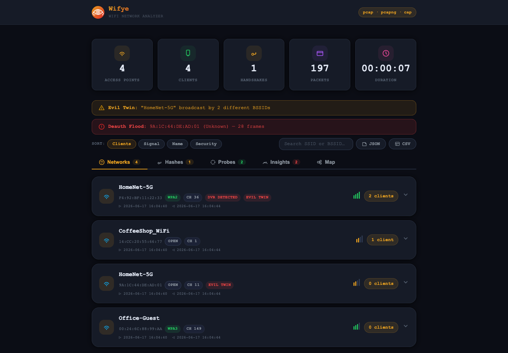
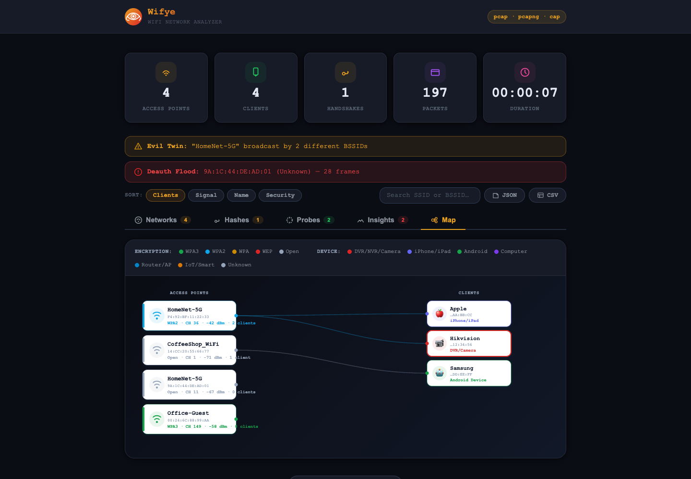
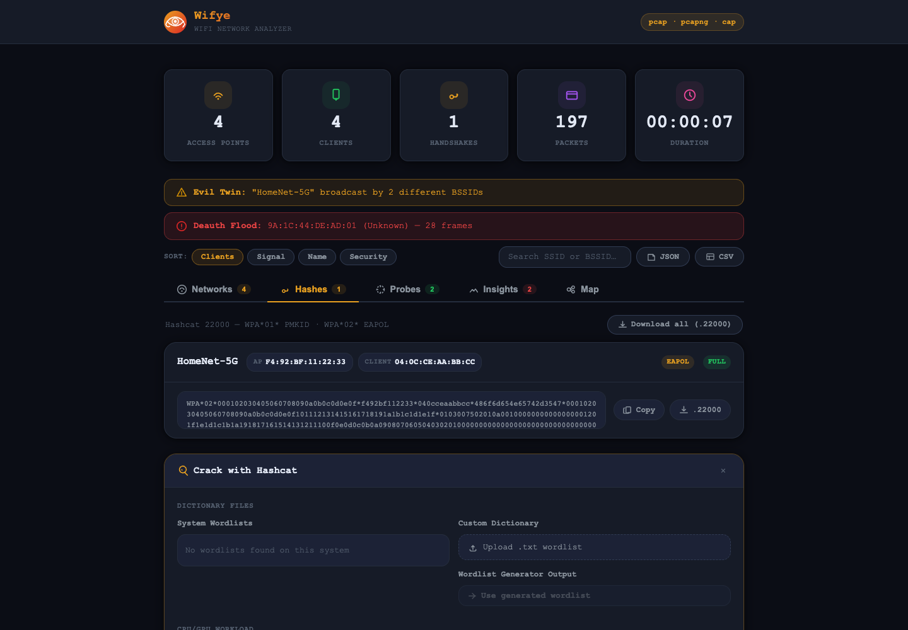

<div align="center">


# Wifye

**Drop in a WiFi capture. Get a map of every network, every device, every threat — and the handshakes to test your passwords.**

[](https://www.python.org/)
[](https://flask.palletsprojects.com/)
[](https://www.docker.com/)
[](https://hashcat.net/hashcat/)

</div>

---

Most pcap analysis means digging through Wireshark filters or squinting at `aircrack-ng` output. **Wifye turns a packet capture into an answer in one drag-and-drop**: who's on the network, what kind of device they are, whether someone's running an evil twin or a deauth attack against you, and — if a handshake was captured — a ready-to-crack hash with hashcat wired in.

It's built for the moment you actually need this: auditing your own network, running a home pentest, or wrapping up a CTF capture before the clock runs out.

<p align="center">
  
</p>

## Why Wifye

- **One drop, full picture.** No CLI flags, no filters to remember — upload a `.pcap`/`.pcapng`/`.cap` and the dashboard fills in.
- **It tells you what's wrong, not just what's there.** Evil twins and deauth floods surface as alert banners, not buried log lines.
- **It fingerprints devices, not just MACs.** OUI lookups plus 802.11 IE analysis mean DVRs, cameras, and IoT gear get called out by name.
- **Handshake to hash to crack, in the same tab.** No juggling `hcxpcapngtool`, hashcat, and a text editor across three terminals.
- **Fast.** Frame parsing runs through a small custom C parser instead of loading Scapy for every packet.

## Features

- **Network mapping** — every AP and client seen in the capture, with SSID, BSSID, encryption type, channel, signal strength, and vendor.
- **Device fingerprinting** — identifies device types (routers, phones, DVR/NVR/cameras, IoT) by combining OUI vendor lookups with 802.11 information-element analysis (WPS IE, HT capabilities, SSID keyword heuristics).
- **WPA handshake extraction** — pulls 4-way EAPOL handshakes and PMKIDs out of the capture and exports them in hashcat `22000` format (`WPA*01*` / `WPA*02*`).
- **Built-in hashcat cracking** — select system wordlists (auto-detects `rockyou.txt` and other common dictionary locations), upload your own dictionary, or feed in a generated wordlist, then run hashcat (`-m 22000`, CPU+GPU, configurable workload) with live progress, speed, and cracked-password results streamed back to the UI.
- **Wordlist generator** — turns seed words (names, companies, years, etc.) into targeted candidate passwords with capitalization, leet-speak, number suffixes, special characters, word-combining, and prefix mutations.
- **Threat detection** — evil twin detection (duplicate SSIDs on different BSSIDs), deauth/disassoc flood detection per client, and a probe-request view of devices searching for known networks.
- **Network map & insights** — SVG topology view of APs and clients, plus a channel-usage chart and alert banners for anything suspicious.
- **Export** — download results as JSON, CSV, a hashcat `.22000` hash file, or a generated wordlist `.txt`.

<p align="center">
  
  
</p>

> **For authorized use only.** Wifye includes a WPA/WPA2 handshake cracker (via [hashcat](https://hashcat.net/hashcat/)) intended strictly for penetration testing and security research on networks you own or are explicitly authorized to test. Do not use it against networks without permission.

## Tech stack

| Layer       | Tech                                                              |
|-------------|--------------------------------------------------------------------|
| Frontend    | Vanilla HTML / CSS / JS, served as static files by Flask           |
| Backend     | Python (Flask + Flask-CORS)                                        |
| Parsing     | Custom C parser (radiotap + 802.11: beacon, probe, assoc, deauth, EAPOL) + Scapy for handshake extraction |
| Cracking    | [hashcat](https://hashcat.net/hashcat/) subprocess (CPU + GPU)     |
| Packaging   | Docker / docker-compose                                            |

## Getting started

### Prerequisites

- Python 3.9+
- `gcc` (to compile the C parser)
- [hashcat](https://hashcat.net/hashcat/) on your `PATH` (only required if you want to use the cracking feature)

### Run locally

```bash
git clone https://github.com/YossiRott/WiFye.git
cd WiFye
./run.sh
```

`run.sh` installs Python dependencies, compiles the C parser if needed, and starts the server at **http://localhost:8080**.

### Run with Docker

```bash
docker compose up --build
```

This builds the image (installing `hashcat`, `gcc`, and `libpcap-dev`, then compiling the parser for Linux) and serves the app at **http://localhost:8080**.

## Usage

1. Open the app and drop in a `.pcap`, `.pcapng`, or `.cap` file (capture it in monitor mode, e.g. with `airodump-ng` or Wireshark).
2. Browse the **Networks** tab for discovered APs/clients, sorted by client count, signal, name, or security type.
3. Check the **Hashes** tab for any captured WPA handshakes — the crack panel opens automatically when handshakes are present.
4. Pick dictionaries (system wordlist, your own upload, or a generated wordlist) and a workload level, then start cracking. Live speed, progress, and cracked passwords stream back to the UI.
5. Use **Insights** for evil-twin/deauth-flood alerts and channel usage, and **Map** for a visual topology of the capture.
6. Use the **Wordlist Generator** section to build a custom dictionary from seed words for targeted attacks.

## API

| Endpoint                       | Method | Description                                  |
|---------------------------------|--------|-----------------------------------------------|
| `/api/analyze`                  | POST   | Upload a capture file, get full analysis JSON |
| `/api/crack/wordlists`          | GET    | List detected system wordlists                |
| `/api/crack/upload-dict`        | POST   | Upload a custom dictionary                     |
| `/api/crack/start`              | POST   | Start a hashcat job                            |
| `/api/crack/status`             | GET    | Poll job status/progress                       |
| `/api/crack/stop`               | POST   | Stop the running job                           |
| `/api/crack/clear`              | POST   | Clear job state                                |
| `/api/wordgen`                  | POST   | Generate a wordlist from seed words            |
| `/api/wordgen/path`             | GET    | Get the path of the last generated wordlist    |

## Project structure

```
WiFye/
├── backend/
│   ├── app.py            # Flask app + API routes
│   ├── analyzer.py       # Calls C parser, builds network/client/alert summary
│   ├── parser.c           # Fast pcap/pcapng → JSON 802.11 frame parser
│   ├── hash_extractor.py # EAPOL handshake / PMKID extraction (Scapy)
│   ├── oui_db.py          # MAC vendor + device-type lookup
│   ├── cracker.py         # Hashcat subprocess management
│   ├── wordgen.py         # Wordlist mutation engine
│   └── requirements.txt
├── frontend/
│   ├── index.html
│   ├── app.js
│   └── style.css
├── docs/screenshots/      # README screenshots
├── run.sh                 # Local dev entrypoint
├── Dockerfile
└── docker-compose.yml
```

## Disclaimer

Wifye is built for educational use and authorized security testing (e.g. assessing your own network's WPA passphrase strength). You are responsible for complying with all applicable laws and for only analyzing or attempting to crack networks you own or have explicit permission to test.
